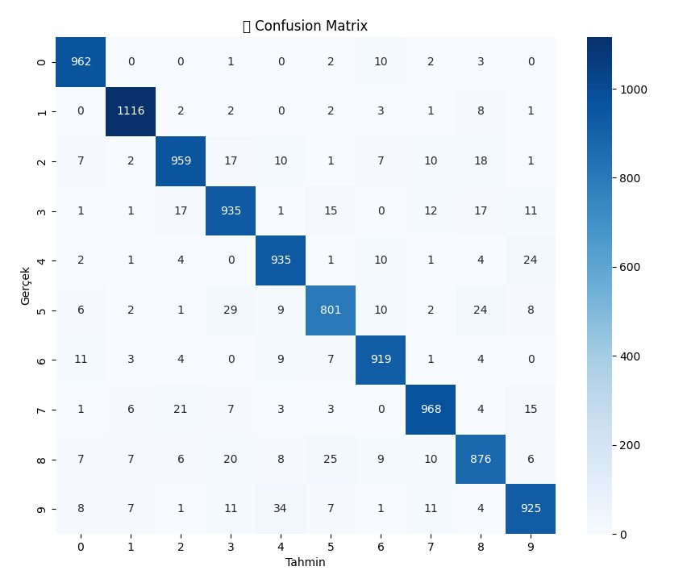

🧠 Dynamic Neuron Growth in Deep Learning
Welcome to the GrowNet project! 🚀 This project explores a new approach to deep learning, where the neural network's architecture grows during training by adding new neurons to the hidden layers. It's like giving your model a brain boost every epoch! 🧠💡

🚀 What's this about?
We start with a small neural network, train it on the MNIST dataset 🧑‍🏫, and after each epoch, we expand the number of neurons in the hidden layers.

The idea? Mimic the biological brain's ability to grow and adapt over time! 🌱

📚 Features
Dynamic neuron growth during training 🌱

Progressive increase in model complexity as training continues 🧠

Built using PyTorch 🔥

Performance improvement as more neurons are added! 🎯

